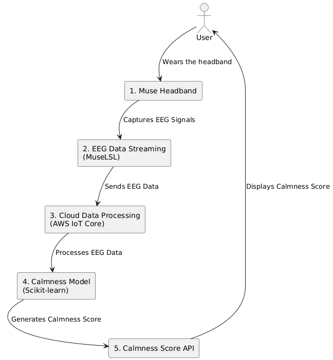

## MX Focus Reader

In this project, we aim to teach students how to maintain focus while performing tasks such as taking an exam. We have developed a VR application that simulates an exam environment. In this setup, the teacher can create and update questions in real-time through a Google Sheet, which is synchronized with the VR environment. The student must stay focused to answer the questions. If the student loses focus, their writing within the VR environment will become shaky and inaccurate. This dynamic helps train students to maintain focus while completing tasks.

---

---

## Project Components

The project consists of the following key components:

1. **VR Environment**: A virtual reality application where students take an exam, simulating a living exam-writing context. In the VR environment, students are required to maintain focus to answer questions accurately.

2. **Teacher's Google Sheet**: The teacher uses a Google Sheet to create and update exam questions. The sheet is synced in real-time with the VR environment, so any changes made by the teacher are immediately reflected in the exam.

3. **Focus Tracking**: A system that tracks the student's focus through EEG signals. If the student becomes distracted, their writing in the VR environment starts to become shaky and inaccurate, providing immediate feedback.

4. **Muse Headband**: A wearable EEG device that captures real-time brainwave signals from the student, used to monitor their focus during the exam.

5. **MuseLSL (Muse Labs Streamer)**: Software that streams the EEG data from the Muse Headband to the cloud in real-time using the Lab Streaming Layer (LSL) protocol.

6. **AWS IoT Core**: A cloud service used to securely transmit EEG data from MuseLSL to the cloud for further processing.

7. **Scikit-learn Model**: A machine learning model that processes the EEG data to assess the student's level of focus based on brainwave frequency bands.

8. **API Gateway**: AWS API Gateway is used to expose the focus score as a REST API, making it accessible for external applications to retrieve and display the student's focus level.

---

## High-Level Workflow

The process flows as follows:

1. The **Student** wears the **Muse Headband** to capture real-time EEG signals during the exam.

2. The **MuseLSL** software streams the EEG data to **AWS IoT Core** in real-time for processing.

3. **AWS IoT Core** transmits the data to a **Scikit-learn model** running in the cloud, which processes the EEG signals to evaluate the student's focus level.

4. The model generates a **focus score**, which indicates how focused the student is while answering the exam questions. If the student loses focus, the VR environment will simulate shaky, inaccurate writing.

5. The focus score is exposed via **AWS API Gateway** and can be retrieved by the VR application or any external system, giving immediate feedback to both the student and the teacher.

---

## How It Works

### 1. Muse Headband
- **Muse Headband** is a wearable EEG device that records brainwave signals in real-time.
- It measures various brainwave frequencies like Alpha, Beta, Theta, and Gamma waves.

### 2. MuseLSL (Muse Labs Streamer)
- **MuseLSL** is a tool that facilitates the streaming of EEG data from the Muse Headband via the **Lab Streaming Layer (LSL)** protocol.
- It allows real-time data collection and transmission to external systems or cloud services like AWS.

### 3. AWS IoT Core
- **AWS IoT Core** is used to securely handle and transmit the EEG data from MuseLSL to the cloud.
- Data from MuseLSL is sent via **MQTT protocol** to AWS IoT Core for real-time processing and analysis.

### 4. Calmness Model (Scikit-learn)
- **Scikit-learn** is used to process the EEG data and generate the calmness score.
- The model classifies brainwave activity into categories (calm vs. not calm) based on the frequency bands.
- It uses machine learning models trained on EEG data to predict calmness.

### 5. Calmness Score API
- The calmness score is made available through a RESTful API, exposed via **AWS API Gateway**.
- External applications (e.g., mobile apps or web apps) can make HTTP requests to this API to retrieve the calmness score in real-time.

---

## Technologies Used

- **Muse Headband**: Wearable EEG device
- **MuseLSL**: Streaming EEG data via LSL protocol
- **AWS IoT Core**: Cloud service for IoT data ingestion
- **Scikit-learn**: Machine learning library used to analyze EEG data
- **AWS Lambda**: Serverless compute for model inference
- **AWS API Gateway**: REST API to expose the calmness score
- **MQTT Protocol**: Communication protocol for real-time data transmission

---

## Setup Instructions

### 1. Muse Headband Setup
- Pair the Muse Headband with your computer using Bluetooth.
- Install MuseLSL on your system to enable data streaming from the Muse Headband.

### 2. Install MuseLSL
Follow the installation instructions in the [MuseLSL repository](https://github.com/muse-lsl/MuseLSL) to stream data from the Muse Headband. Ensure that the EEG data is streaming to a local server or cloud destination.

### 3. AWS IoT Core Setup
- Set up an **AWS IoT Core** instance to securely handle incoming data.
- Configure AWS IoT Core to receive and process the EEG data stream via MQTT.
- Create and manage **Things** (representing the Muse Headband) within AWS IoT Core.

### 4. Model Training & Inference
- Train a machine learning model using **Scikit-learn** on a dataset of EEG signals to classify calmness based on brainwave frequencies.
- Deploy the trained model on **AWS Lambda** or an **EC2 instance** for inference.

### 5. Exposing Calmness Score via API
- Set up **AWS API Gateway** to expose the calmness score as a REST API.
- Integrate AWS Lambda with API Gateway to generate and serve the calmness score.