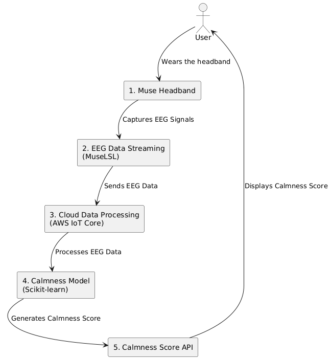

## MX Focus Reader

In this project, we aim to teach students how to maintain focus while performing tasks such as taking an exam. We have developed a VR application that simulates an exam environment. In this setup, the teacher can create and update questions in real-time through a Google Sheet, which is synchronized with the VR environment. The student must stay focused to answer the questions. If the student loses focus, their writing within the VR environment will become shaky and inaccurate. This dynamic helps train students to maintain focus while completing tasks.

## Contributors

Special thanks to the people who helped turn MX Focus from a promising
prototype into a much stronger, locally runnable project:

- **[Buse Duygun (@BuseDuygun22)](https://github.com/BuseDuygun22)** made an
  outstanding contribution by rebuilding the local EEG metrics pipeline,
  fixing major data-loss and request-storm bugs, adding drowsiness-aware VR
  feedback, session reporting, and a hardware-free demo. Her work makes the
  project substantially easier to run, test, and demonstrate.
- **[Sude Duygun (@SudeDuygun11)](https://github.com/SudeDuygun11)** did an
  excellent job designing the tested band-power and per-student focus-scoring
  pipeline, adding real-time WebSocket transport, Unity client components,
  and thorough technical documentation. Her careful engineering gives the
  project a strong, well-tested foundation for future EEG experiments.

We are genuinely grateful to both Buse and Sude for the thoughtfulness,
technical depth, and care they brought to MX Focus.

---



---

## Project Components

The project consists of the following key components:

1. **VR Environment**: A virtual reality application where students take an exam, simulating a living exam-writing context. In the VR environment, students are required to maintain focus to answer questions accurately.

2. **Teacher's Google Sheet**: The teacher uses a Google Sheet to create and update exam questions. The sheet is synced in real-time with the VR environment, so any changes made by the teacher are immediately reflected in the exam.

3. **Focus Tracking**: A system that tracks the student's focus through EEG signals. If the student becomes distracted, their writing in the VR environment starts to become shaky and inaccurate, providing immediate feedback.

4. **Muse Headband**: A wearable EEG device that captures real-time brainwave signals from the student, used to monitor their focus during the exam.

5. **MuseLSL (Muse Labs Streamer)**: Software that streams the EEG data from the Muse Headband to the cloud in real-time using the Lab Streaming Layer (LSL) protocol.

6. **AWS IoT Core**: A cloud service used to securely transmit EEG data from MuseLSL to the cloud for further processing.

7. **Scikit-learn Model**: A machine learning model that processes the EEG data to assess the student's level of focus based on brainwave frequency bands.

8. **API Gateway**: AWS API Gateway is used to expose the focus score as a REST API, making it accessible for external applications to retrieve and display the student's focus level.

---

## High-Level Workflow

The process flows as follows:

1. The **Student** wears the **Muse Headband** to capture real-time EEG signals during the exam.

2. The **MuseLSL** software streams the EEG data to **AWS IoT Core** in real-time for processing.

3. **AWS IoT Core** transmits the data to a **Scikit-learn model** running in the cloud, which processes the EEG signals to evaluate the student's focus level.

4. The model generates a **focus score**, which indicates how focused the student is while answering the exam questions. If the student loses focus, the VR environment will simulate shaky, inaccurate writing.

5. The focus score is exposed via **AWS API Gateway** and can be retrieved by the VR application or any external system, giving immediate feedback to both the student and the teacher.

---

## How It Works

### 1. Muse Headband
- **Muse Headband** is a wearable EEG device that records brainwave signals in real-time.
- It measures various brainwave frequencies like Alpha, Beta, Theta, and Gamma waves.

### 2. MuseLSL (Muse Labs Streamer)
- **MuseLSL** is a tool that facilitates the streaming of EEG data from the Muse Headband via the **Lab Streaming Layer (LSL)** protocol.
- It allows real-time data collection and transmission to external systems or cloud services like AWS.

### 3. AWS IoT Core
- **AWS IoT Core** is used to securely handle and transmit the EEG data from MuseLSL to the cloud.
- Data from MuseLSL is sent via **MQTT protocol** to AWS IoT Core for real-time processing and analysis.

### 4. Calmness Model (Scikit-learn)
- **Scikit-learn** is used to process the EEG data and generate the calmness score.
- The model classifies brainwave activity into categories (calm vs. not calm) based on the frequency bands.
- It uses machine learning models trained on EEG data to predict calmness.

### 5. Calmness Score API
- The calmness score is made available through a RESTful API, exposed via **AWS API Gateway**.
- External applications (e.g., mobile apps or web apps) can make HTTP requests to this API to retrieve the calmness score in real-time.

---

## Technologies Used

- **Muse Headband**: Wearable EEG device
- **MuseLSL**: Streaming EEG data via LSL protocol
- **AWS IoT Core**: Cloud service for IoT data ingestion
- **Scikit-learn**: Machine learning library used to analyze EEG data
- **AWS Lambda**: Serverless compute for model inference
- **AWS API Gateway**: REST API to expose the calmness score
- **MQTT Protocol**: Communication protocol for real-time data transmission

---

## Setup Instructions

### 1. Muse Headband Setup
- Pair the Muse Headband with your computer using Bluetooth.
- Install MuseLSL on your system to enable data streaming from the Muse Headband.

### 2. Install MuseLSL
Follow the installation instructions in the [MuseLSL repository](https://github.com/muse-lsl/MuseLSL) to stream data from the Muse Headband. Ensure that the EEG data is streaming to a local server or cloud destination.

### 3. AWS IoT Core Setup
- Set up an **AWS IoT Core** instance to securely handle incoming data.
- Configure AWS IoT Core to receive and process the EEG data stream via MQTT.
- Create and manage **Things** (representing the Muse Headband) within AWS IoT Core.

### 4. Model Training & Inference
- Train a machine learning model using **Scikit-learn** on a dataset of EEG signals to classify calmness based on brainwave frequencies.
- Deploy the trained model on **AWS Lambda** or an **EC2 instance** for inference.

### 5. Exposing Calmness Score via API
- Set up **AWS API Gateway** to expose the calmness score as a REST API.
- Integrate AWS Lambda with API Gateway to generate and serve the calmness score.

---

## Local Development (no AWS, no headband required)

The AWS API Gateway endpoint the Unity client originally called
(`.../prod/calmness_data`) no longer resolves — that stack has been torn
down. This branch adds a local pipeline that reproduces the same contract
and extends it, so the project can be developed and demoed without any
cloud dependency and without a physical Muse headband.

### Setup

```bash
cd muse
python -m venv ../.venv
../.venv/Scripts/activate   # or source ../.venv/bin/activate on macOS/Linux
pip install -r requirements.txt
```

### Running without hardware

```bash
# Terminal 1 - synthetic EEG source (real Muse: `muselsl stream` instead)
python mock_muse_stream.py --state sweep

# Terminal 2 - local metrics engine + REST API
python focus_metrics.py --print
```

Point `MxInkHandler.cs`'s `_metricsURL` at `http://127.0.0.1:8000/metrics`
(already the default in this branch) and press Play in Unity — no VR
headset needed to verify the scene loads and the HTTP calls succeed; a
headset + Logitech MX Ink stylus is still required to see the actual
in-VR interaction, since there is no keyboard/mouse fallback.

To see the feedback loop itself without a headset, open
[`muse/feedback_demo.html`](muse/feedback_demo.html) directly in a
browser while `focus_metrics.py` is running — it polls the same live
server and reproduces the jitter/audio math in 2D.

### What's new in this branch

- **Fixed a data-loss bug**: `stream_eeg.py` was pulling 1 EEG sample/sec
  from a 256 Hz stream (`max_samples=1` + `sleep(1)`), discarding ~99.6%
  of the signal. It now drains whatever has buffered each tick.
- **Fixed a request-storm bug**: `MxInkHandler.cs` was polling the
  calmness endpoint every **10 ms** (100 req/s, indefinitely). Now polls
  every 0.5 s via the new `_metricsPollInterval` (tunable in the Inspector).
- **`muse/focus_metrics.py`** — a local metrics engine + REST API that
  replaces the dead AWS chain (MuseLSL → AWS IoT Core → Lambda/Scikit-learn
  → API Gateway) with `LSL → Welch PSD → HTTP`, running entirely on the
  dev machine:
  - `GET /calmness_data` — byte-compatible with the old AWS envelope, so
    existing Unity parsing keeps working unchanged.
  - `GET /metrics` — the full metric set: `calmness`, `focus`,
    `engagement`, `theta_beta_ratio`, `workload`, `alpha_asymmetry`,
    `drowsiness`, `artifact_ratio`, band powers, and per-channel signal
    quality.
  - `GET /health` — stream liveness and signal quality, so a badly-seated
    headband can be flagged instead of silently producing garbage scores.
- **Drowsiness index** — `(theta_relative + delta_relative) / beta_relative`,
  using *relative* (not absolute) band power so electrode-contact swings
  don't masquerade as a state change, with alpha deliberately excluded
  (it rises in both a calm-focused state and early drowsiness, so it
  can't discriminate the two) and a ~3 s rolling-median smoother, since
  drowsiness is a slow physiological state rather than a per-tick signal.
- **Per-student session logging + teacher dashboard** — `focus_metrics.py`
  now records a timestamped `metrics.csv` and `events.jsonl` per exam
  session (`POST /session/start`, `/session/stop`, `/session/event`).
  Since the teacher's exam questions are added progressively to the live
  Google Doc rather than paginated in the VR scene, Unity logs a
  `question_appeared` event the first time each question number shows up
  in the fetched text, giving a timestamp to correlate against. On
  `/session/stop`, `muse/session_report.py` renders a self-contained
  `report.html` per session: a focus/engagement/workload/drowsiness
  timeline chart annotated with question markers, summary stat cards, and
  a per-question breakdown table.
- **Multi-band closed-loop feedback** — replaces the old binary jitter
  (`if calmness < 0.45: 50% chance of fixed-amplitude noise`) with jitter
  that scales continuously with `(1 - focus)`, and adds an ambient audio
  drone (procedurally generated, no audio asset needed) whose volume
  rises continuously with `drowsiness²`.
- **`muse/mock_muse_stream.py`** — publishes a synthetic LSL EEG outlet
  (same `type=EEG`, 5-channel, 256 Hz contract as `muselsl stream`) that
  sweeps between a focused (beta-dominant) and distracted (theta-dominant)
  band profile, for hardware-free development.
- **`muse/feedback_demo.html`** — a standalone 2D preview of the jitter +
  audio feedback loop, driven by the same live `focus_metrics.py` server,
  for verifying the feedback logic without a VR headset.
